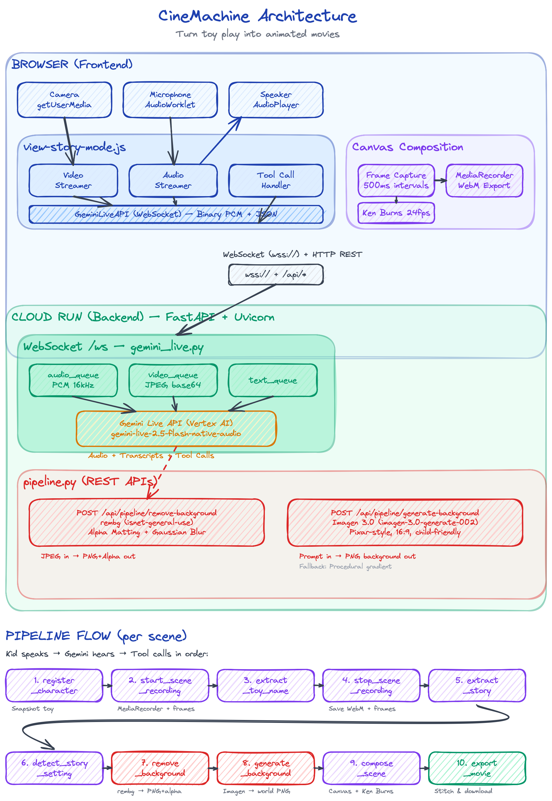

# CineMachine

*Turn toy play into animated movies. Just press record.*

[](https://fastapi.tiangolo.com/)
[](https://cloud.google.com/vertex-ai/generative-ai/docs/live-api)
[](https://cloud.google.com/run)

### [Try the Live Demo — https://cinemachine-684023745855.us-central1.run.app](https://cinemachine-684023745855.us-central1.run.app)

---

## What is CineMachine?

Every kid is a storyteller. CineMachine turns that natural creativity into real animated movies — using nothing but toys and a camera.

A child places a toy in front of a camera, talks to an AI movie director, acts out scenes, and CineMachine handles the rest:

- **Segments the toy** from the video, cleanly separating it from hands and background
- **Generates a fantasy world** as the backdrop — forests, castles, outer space — based on voice conversation
- **Composes cinematic scenes** with Ken Burns panning, crossfade transitions, and soft shadows
- **Exports a polished animated short film** — all from a single play session

---

## Architecture

<div align="center">
  
</div>

The system is split into three layers:

### Browser (Frontend)
The frontend is built with **Vanilla JavaScript and Web Components**, bundled with **Vite**. It manages three parallel streams:
- **Camera** (`getUserMedia`) — captures the live video feed and streams frames to the backend
- **Microphone** (`AudioWorklet`) — captures PCM audio at 16kHz and sends it over WebSocket
- **Speaker** (`AudioPlayer`) — plays back the AI director's voice responses in real-time
- **Canvas Compositor** — renders the final movie at 1280x720, 24fps with Ken Burns panning, crossfade transitions, and soft shadows. `MediaRecorder` captures the canvas output as WebM.

All of this lives in `view-story-mode.js`, which also handles tool call responses from the AI director.

### Cloud Run (Backend)
The backend is **FastAPI + Uvicorn** deployed on **Google Cloud Run**. It has two main entry points:

- **`/ws` (WebSocket)** in `server/main.py` — Bidirectional bridge between the browser and the **Gemini Live API**. Streams PCM audio and video frames to Gemini, receives voice responses and function calls back. Runs 3+ concurrent async tasks per session (send audio, send video, receive responses).

- **`/api/pipeline/*` (REST)** in `server/pipeline.py` — Processing endpoints that the AI director triggers via function calling:
  - `POST /api/pipeline/remove-background` — Runs **rembg** (`isnet-general-use` model) with alpha matting and Gaussian blur for clean toy segmentation
  - `POST /api/pipeline/generate-background` — Calls **Imagen 3.0** to generate Pixar-style animated backgrounds matching the story setting

### Pipeline Flow (per scene)
The AI director orchestrates these 10 steps via function calling — no hardcoded state machine:

1. **Register character** — Kid shows toy, director names it
2. **Start scene recording** — Director calls "Action!", MediaRecorder starts
3. **Extract toy name** — Identify the character in frame
4. **Stop scene recording** — Director calls "Cut!"
5. **Extract story** — Parse narrative from the conversation
6. **Detect story setting** — Identify the world (jungle, castle, space, etc.)
7. **Remove background** — rembg segments the toy from captured frames
8. **Generate background** — Imagen 3.0 creates the world as a PNG
9. **Compose scene** — Canvas composites toy onto background with Ken Burns + crossfade
10. **Export movie** — Final WebM packaged for download

---

## Google Cloud — Deep Integration

CineMachine is built end-to-end on Google Cloud. Here's every service we use and why:

### Gemini Live API (Vertex AI) — The Brain
**File:** [`server/main.py`](server/main.py)

The entire app revolves around the **Gemini Live API** (`gemini-live-2.5-flash-native-audio`) accessed through **Vertex AI**. This isn't a simple prompt-response setup — it's a persistent, real-time, bidirectional session:

- **Real-time voice conversation** — PCM audio streams in both directions over WebSocket at 16kHz. The AI director talks naturally with kids, with sub-second latency.
- **Multimodal input** — Video frames from the camera are sent alongside audio, so the director can *see* what the kid is doing with their toys.
- **Function calling for orchestration** — Instead of building a complex state machine, we give Gemini 10+ tool definitions and let it decide when to call each one based on the conversation flow. This makes the experience feel natural — the director calls "Action!" when the kid is ready, not when a timer fires.
- **Native audio output** — The model generates speech directly (not TTS on top of text), which gives the director a natural, expressive voice.

```python
# server/main.py — Gemini Live session setup
client = genai.Client(vertexai=True, project=project_id, location=location)
session = client.aio.live.connect(
    model=model,
    config=types.LiveConnectConfig(
        response_modalities=["AUDIO"],
        system_instruction=system_instructions,
        tools=tool_definitions,  # 10+ function declarations
    )
)
```

### Imagen 3.0 (Vertex AI) — World Generation
**File:** [`server/pipeline.py`](server/pipeline.py)

When the AI director detects a story setting (e.g., "a dark jungle with glowing mushrooms"), it triggers a function call that hits our `/api/pipeline/generate-background` endpoint. This calls **Imagen 3.0** (`imagen-3.0-generate-002`) through the Vertex AI SDK:

- Generates **Pixar-style animated backgrounds** in 16:9 cinematic aspect ratio
- Prompt engineering ensures child-friendly, vibrant, text-free images suitable as animation backdrops
- Built-in **gradient fallback** — if Imagen is slow or fails, we generate a procedural gradient background color-matched to the setting (green for jungle, blue for ocean, purple for space) so the pipeline never stalls

```python
# server/pipeline.py — Imagen background generation
client = genai.Client(vertexai=True, project=project_id, location=location)
response = client.models.generate_images(
    model="imagen-3.0-generate-002",
    prompt=full_prompt,
    config=types.GenerateImagesConfig(
        number_of_images=1,
        aspect_ratio="16:9",
        safety_filter_level="BLOCK_MEDIUM_AND_ABOVE",
    ),
)
```

### Google Cloud Run — Production Hosting
**File:** [`scripts/deploy.sh`](scripts/deploy.sh), [`Dockerfile`](Dockerfile)

The app is deployed as a containerized service on **Google Cloud Run**:

- **Multi-stage Docker build** — Stage 1 (Node 22-Alpine) builds the Vite frontend, Stage 2 (Python 3.10-slim) runs the FastAPI backend serving the built static files
- **Session affinity** — Critical for WebSocket persistence. Without it, Cloud Run's load balancer would route subsequent requests to different instances, breaking the live audio stream
- **1 GiB memory** — rembg's `isnet-general-use` model needs ~500MB for inference; the rest covers concurrent WebSocket sessions
- **`--allow-unauthenticated`** — Public access so kids can open the app without any login

```bash
# scripts/deploy.sh
gcloud run deploy cinemachine \
  --source . \
  --region us-central1 \
  --allow-unauthenticated \
  --session-affinity \
  --memory 1Gi \
  --set-env-vars PROJECT_ID=cinemachine-app \
  --set-env-vars LOCATION=us-central1 \
  --set-env-vars MODEL=gemini-live-2.5-flash-native-audio
```

### google-genai SDK — Unified Access
Both Gemini Live and Imagen 3.0 are accessed through the **`google-genai` Python SDK** with Vertex AI mode enabled. A single SDK handles:
- Live streaming sessions (WebSocket-based, bidirectional audio + video)
- Image generation requests (REST-based, single-shot)
- Authentication via Application Default Credentials — no API keys to manage

---

## Tech Stack

| Layer | Technology |
|-------|-----------|
| Frontend | Vanilla JavaScript, Web Components, Vite |
| Real-time Audio | Web Audio API, AudioWorklets, PCM 16kHz over WebSocket |
| Video Composition | Canvas API (24fps), MediaRecorder API, Ken Burns + crossfade |
| Backend | Python, FastAPI, Uvicorn |
| AI Director | Gemini Live API (`gemini-live-2.5-flash-native-audio`) with function calling |
| Background Removal | `rembg` with `isnet-general-use` model, alpha matting, Gaussian blur |
| World Generation | Imagen 3.0 (`imagen-3.0-generate-002`) via Vertex AI |
| Deployment | Docker (multi-stage), Google Cloud Run, session affinity |

---

## Reproducible Testing Instructions

Follow these steps to test CineMachine yourself.

### Option A: Use the Live Demo (Fastest)

1. Open **https://cinemachine-684023745855.us-central1.run.app** on a laptop/desktop with a webcam
2. Click **Start** and allow camera + microphone permissions
3. Talk to the AI director — it will greet you and guide you through making a movie
4. Place a toy in front of the camera. The director will help you:
   - **Register a character** (show a toy, give it a name)
   - **Plan a story** (describe a setting and plot)
   - **Record scenes** (the director calls "Action!" and "Cut!")
5. After recording, CineMachine processes the scenes:
   - Removes the background from your toy frames
   - Generates an AI background matching your story
   - Composites everything into a cinematic animation
6. Watch and download your finished movie

### Option B: Run Locally

#### Prerequisites

- Node.js v18+
- Python 3.10+
- Google Cloud project with **Vertex AI API** enabled
- `gcloud` CLI authenticated (`gcloud auth application-default login`)

#### 1. Clone and install

```bash
git clone https://github.com/AjayPoshak/immersive-language-learning-with-live-api.git
cd immersive-language-learning-with-live-api
./scripts/install.sh
```

#### 2. Configure environment

```bash
cp .env.example .env
```

Edit `.env` with your Google Cloud project details:

```
PROJECT_ID=your-gcp-project-id
LOCATION=us-central1
MODEL=gemini-live-2.5-flash-native-audio
DEV_MODE=true
```

#### 3. Run the dev server

```bash
./scripts/dev.sh
```

This starts:
- Backend (Uvicorn) on port **8000**
- Frontend (Vite) on port **5173**

Open **http://localhost:5173** in Chrome (webcam + mic required).

#### 4. Test the flow

1. Click Start — the AI director ("CineMachine") greets you via voice
2. Show a toy to the camera and tell the director its name
3. Describe a story setting (e.g., "a jungle adventure")
4. The director calls "Action!" — act out a scene with your toy
5. The director calls "Cut!" — the pipeline processes your scene
6. Watch the composed animation with AI-generated backgrounds

### Option C: Deploy to Cloud Run

```bash
./scripts/deploy.sh
```

Deploys to Google Cloud Run with `--session-affinity` for WebSocket persistence. Requires `gcloud` CLI configured with your project.

---

## Project Structure

```
.
├── src/
│   ├── components/
│   │   └── view-story-mode.js    # Main component: AI director, tools, recording, composition
│   ├── styles/                   # CSS
│   └── main.js                   # Entry point
├── server/
│   ├── main.py                   # FastAPI app, WebSocket handler, Gemini Live integration
│   └── pipeline.py               # /api/pipeline endpoints (rembg, Imagen)
├── scripts/
│   ├── dev.sh                    # Start dev environment
│   ├── deploy.sh                 # Deploy to Cloud Run
│   └── install.sh                # Install all dependencies
├── Dockerfile                    # Multi-stage build (Node + Python)
├── .env.example                  # Environment template
└── DEVPOST.md                    # Hackathon submission
```

---

## Built With

JavaScript, Python, FastAPI, Vite, Web Components, Web Audio API, Canvas API, MediaRecorder API, WebSocket, Gemini Live API, Vertex AI, Imagen 3.0, rembg, Pillow, Google Cloud Run, Docker

---

## License

Apache 2.0
